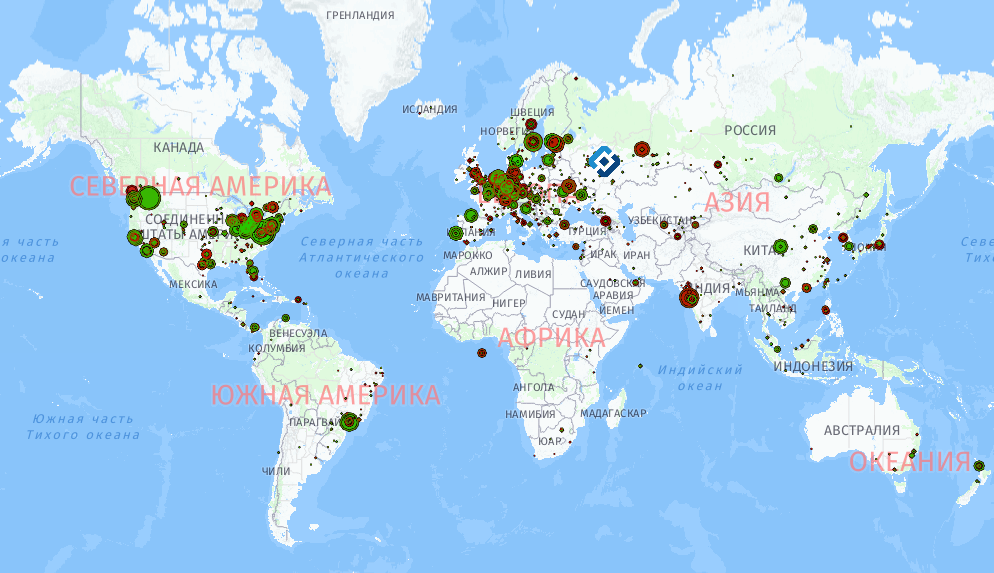

# Map of IP addresses that are blocked in Russia

Visit [blockedhere.pythonanywhere.com](http://blockedhere.pythonanywhere.com/) to explore it!

Project for [MLH 2018 Moscow Hack](hack.moscow).

Implemented with HERE Geo-API, inspired by [RosKomSvoboda](rublacklist.net).

The data is taken from [Zapret-Info repository](https://github.com/zapret-info/z-i) and can be processed in 2 ways: 
* getting it from a particular snapshot of the IP list (faster, but less history is available);
* cloning the whole repo and iterating through commits (takes time, gives the full history).



# Usage (python 3.6 environment)

```bash
pip -r install requirements.txt
python init_db.py
```

## Snapshot mode
1. Get the [list of blocked IPs](https://github.com/zapret-info/z-i/blob/master/dump.csv), put it into ```data/dump.csv```.

2. Run:
```bash
python csv_parser.py
python geodata_loader.py
```

## Complete mode

1. Clone the whole [Zapret-Info repo](https://github.com/zapret-info/z-i) (default: to ```../z-i/```).

Inside the Zapret-Info directory, reset it to the first revision:
```bash
git reset --hard e784cde5c35ba786b4fa6499e8972c0175beab16
```

2. Run:
```bash
python update_from_repo.py
```

3. Wait..

## Visualization

```bash
python app.py
```

Voilà!

ver

## Built by

Madidea Team ( [alexeyqu](https://github.com/alexeyqu), [neganovalexey](https://github.com/neganovalexey), [paulin-mipt](https://github.com/paulin-mipt), [Pitovsky](https://github.com/Pitovsky) )
